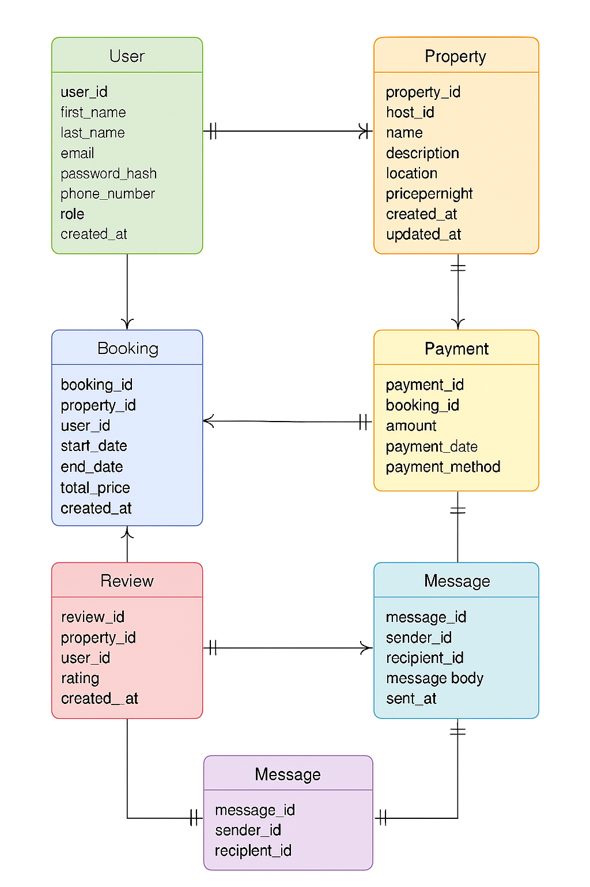

## Entity-Relationship Diagram

The following ER diagram illustrates the structure of the Airbnb-style database, including entities, attributes, and relationships:

### Entities Included:
- **User**: Stores user details including role and contact info.
- **Property**: Represents listings hosted by users.
- **Booking**: Tracks reservations made by users for properties.
- **Payment**: Records payment details linked to bookings.
- **Review**: Captures user feedback on properties.
- **Message**: Enables communication between users.

### Key Relationships:
- A **User** can host multiple **Properties**.
- A **User** can make multiple **Bookings**.
- A **Booking** is linked to one **Property** and one **User**.
- A **Booking** has one **Payment**.
- A **User** can leave multiple **Reviews** for different **Properties**.
- A **User** can send and receive **Messages** to/from other users.

This diagram helps visualize the relational structure and supports database design, normalization, and implementation.

